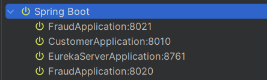

## 🏗️ Architecture


## 🏗️ Eureka Server usage


To test Eureka Server I run one Eureka Server, one Customer microservice and **two** Fraud microservices with different ports. I do it with VM option e.g. `-Dserver.port=8021`:



Then I see that when I use FraudClient Eureka Server sends first request to `8021 Fraud`, but the second one is going to `8020 Fraud`, so it works.

## Kubernetes
I use minikube and kuectl for dev K8S cluster.
I can run amigoscode/kubernetes:hello-world app in my cluster with this command:
`kubectl run hello-world --image=amigoscode/kubernetes:hello-world --port=80`

Then I can start postgres with `kubectl apply -f bootstrap/postgres` (do it only for development)

Then I can create databases:
```$ kubectl exec -it postgres-0 -- psql -U amigoscode
psql (17.8 (Debian 17.8-1.pgdg13+1))
Type "help" for help.

amigoscode=# \l
List of databases
Name    |   Owner    | Encoding | Locale Provider |  Collate   |   Ctype    | Locale | ICU Rules |     Access privileges     
------------+------------+----------+-----------------+------------+------------+--------+-----------+---------------------------
amigoscode | amigoscode | UTF8     | libc            | en_US.utf8 | en_US.utf8 |        |           |
postgres   | amigoscode | UTF8     | libc            | en_US.utf8 | en_US.utf8 |        |           |
template0  | amigoscode | UTF8     | libc            | en_US.utf8 | en_US.utf8 |        |           | =c/amigoscode            +
|            |          |                 |            |            |        |           | amigoscode=CTc/amigoscode
template1  | amigoscode | UTF8     | libc            | en_US.utf8 | en_US.utf8 |        |           | =c/amigoscode            +
|            |          |                 |            |            |        |           | amigoscode=CTc/amigoscode
(4 rows)

amigoscode=# create database customer;
CREATE DATABASE
amigoscode=# create database fraud;
CREATE DATABASE
amigoscode=# create database notification;
CREATE DATABASE
amigoscode=#
\q```
